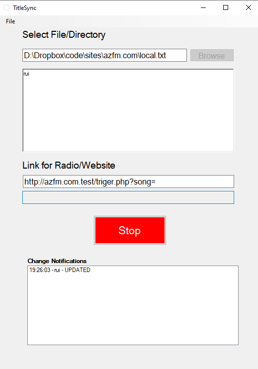

# TitleSync
## Installation
Download and install the program

[TitleSyncSetup.exe](https://github.com/rtralmeida/TitleSync/raw/master/resources/Output/TitleSyncSetup.exe)

---
## How to use it

1. Install
2. Choose file to watch for changes
3. Insert link to make a GET request (ex: https://example.com?song=)
4. Goto [File] > [Insert Token] > Insert your super secret token
5. Press connect
6. Program is now watching for changes to your file
7. Done!  

---

## What's it?
Every time a file is modified the program makes a GET request with those changes as a parameter

for example:
1. contents of textfile.txt is modified too "BOHEMIAN RHAPSODY" 
2. program make a request
    
    http://example.com?content=BOHEMIAN%20RHAPSODY&token=your-super-secret-token

---

## Screenshots
Makes GET request each time a file is changed

---
## Why?

The program used in the radio station, saves to a text file, the current track song currently playing. 

I made this simple program, because I needed to send to a webserver the track song currently playing in radio station. 

The program makes a get request with that track song, then the server captures that request and updates the player present in the radio station website. 